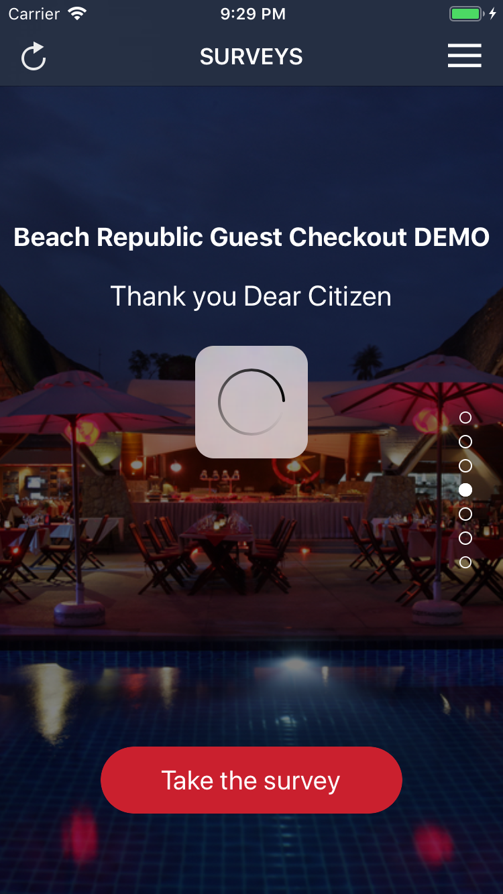

# surveys
[![Build Status][travis-img]][travis-url]

## Overview

- Create an application that allows users to browse a list of surveys. 
- Integrate with an API to retrieve data.
- Write unit tests.

### Prerequisites

- Xcode 10+
- Swift 4+
- Target iOS >= 10.0
- Ruby 2.5.1 ([rbenv][rbenv])

```bash
rbenv install 2.5.1
```

- [Bundler][bundler] (manage [cocoapods][cocoapods])

```bash
gem install bundler
```

### Installing

After you install `ruby-2.5.1` and `bundler`

Run this command to install `cocoapods`

```bash
bundle install
```

Then, install dependencies in this project via **Cocoapods**

```bash
bundle exec pod install
```

Now, run your project with Xcode and see the demo app

## Demo

<table>
  <tr>
    <td></td>
    <td></td>
    <td></td>
  </tr>
</table>

## Authors

* [@suho][suho]

[suho]: https://github.com/suho
[bundler]: https://bundler.io/
[rbenv]: https://github.com/rbenv/rbenv
[cocoapods]: https://cocoapods.org/
[fastlane]: https://fastlane.tools/
[travis-img]: https://travis-ci.com/suho/surveys.svg?branch=master
[travis-url]: https://travis-ci.com/suho/surveys